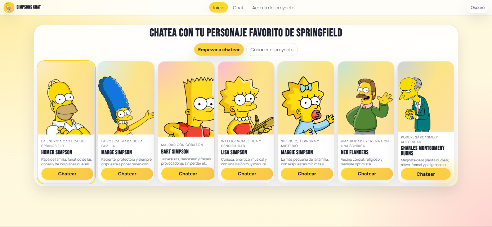
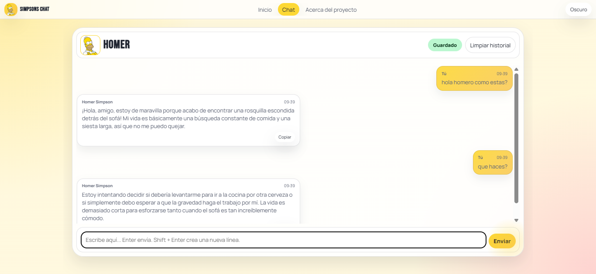
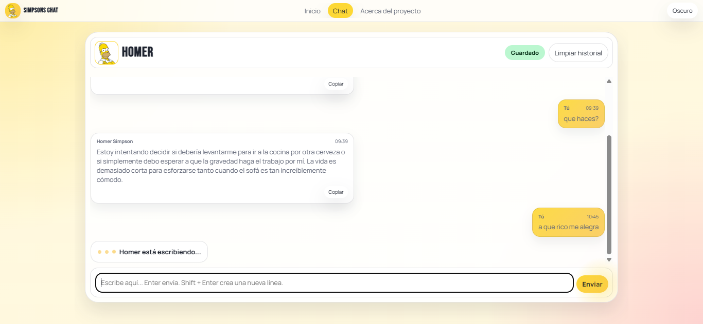
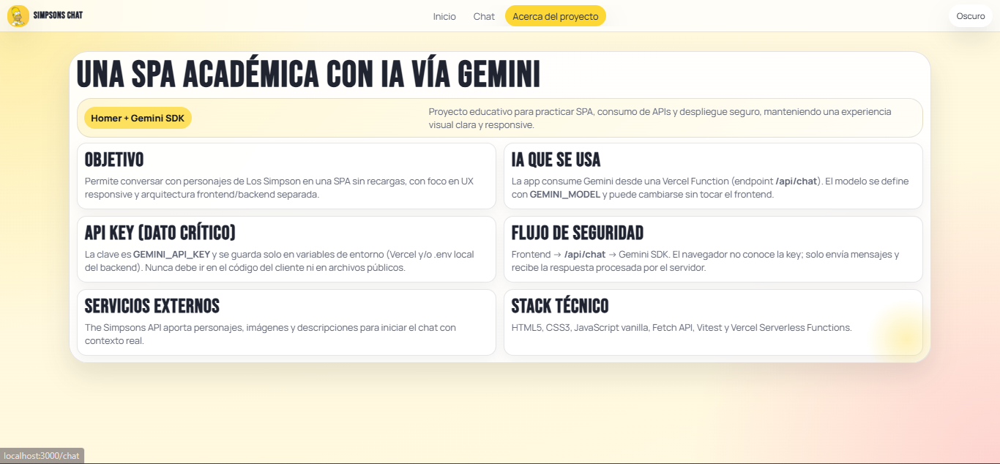
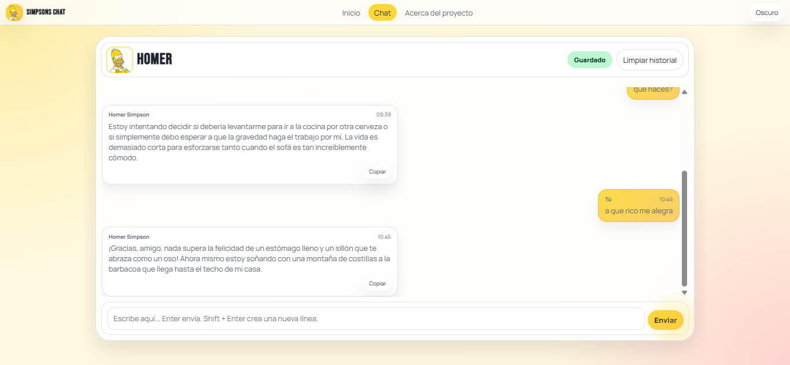
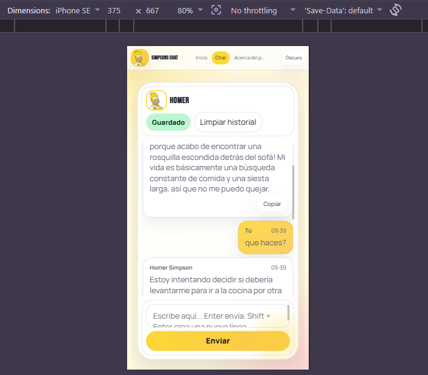
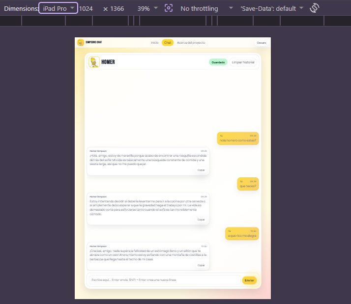

# Simpsons Chat - Proyecto Integrador M3

**Proyecto Integrador del Módulo 3**  
Autor: **Raul Alejandro Carmona Cuellar**

> SPA responsive en JavaScript vanilla para chatear con personajes de Los Simpson usando Gemini a través de una Vercel Function y el SDK de Google.

---

## ✨ ¿Qué hace?

Simpsons Chat es una **Single Page Application** que permite conversar con personajes de Los Simpson dentro de una experiencia responsive, con navegación por rutas y consumo seguro de IA.

Incluye:
- Vista de inicio con acceso al chat
- Vista de chat con historial de conversación en sesión
- Vista About con explicación del proyecto
- Routing SPA con `History API`
- Estados de carga, error y "escribiendo..."
- Diferenciación visual entre mensajes del usuario y del personaje
- Copiar respuestas del personaje al portapapeles
- Modo claro/oscuro con toggle
- Persistencia de personaje seleccionado e historial por personaje en `localStorage`

---

## 🧠 Contexto del proyecto

Este proyecto se desarrolló como una prueba de concepto para una app interactiva donde los usuarios pueden chatear con personajes ficticios usando inteligencia artificial.

La idea fue construir una solución que permitiera:
- practicar **SPA**, **routing** y **responsive design**,
- integrar una IA de forma **segura**,
- mantener una arquitectura simple y clara,
- y desplegar el resultado final en Vercel.

El trabajo fue realizado por **Raul Alejandro Carmona Cuellar**. La IA se usó como **apoyo técnico y documental**, no como autora del proyecto.

---

## 🚀 Funcionalidad principal

### Vistas
- `/home`: pantalla de bienvenida con acceso al chat y selección visual del personaje
- `/chat`: interfaz principal de conversación
- `/about`: explicación del proyecto, la IA usada y la arquitectura

### Chat
- Mensajes diferenciados por rol
- Indicador de escritura mientras responde la IA
- Botón para copiar respuestas del personaje
- Historial guardado durante la sesión y por personaje
- Envío con botón y con `Enter`
- Scroll automático al último mensaje
- Manejo de errores si falla la petición a la API

### Responsive
- Diseño **mobile-first**
- Adaptación a móvil, tablet y desktop
- Uso de **Flexbox**, **Grid** y **media queries**
- Interfaz compacta, usable y sin scroll horizontal

---

## 🧩 Arquitectura técnica

### Frontend
- HTML5
- CSS3
- JavaScript vanilla
- Fetch API
- History API
- LocalStorage

### Backend / IA
- Vercel Serverless Functions
- SDK de Google para Gemini (`@google/genai`)
- The Simpsons API para obtener personajes e imágenes

### Testing
- Vitest
- Mocking de respuestas y transformaciones

---

## 🤖 Integración de IA

Este proyecto se integró con **Gemini** mediante el **SDK de Google** y una Vercel Function para no exponer la API key en el frontend.

### Flujo técnico
1. El frontend llama a `/api/chat` con `characterId` y `messages`.
2. La Vercel Function recibe el historial y busca el personaje.
3. El backend construye el `system prompt` con la personalidad del personaje.
4. El SDK de Gemini genera la respuesta usando el modelo configurado.
5. La respuesta se normaliza y se devuelve al frontend.

### Variables de entorno utilizadas
```env
GEMINI_API_KEY=tu_clave_real
GEMINI_MODEL=gemini-3.1-flash-lite
GEMINI_MAX_TOKENS=700
GEMINI_TEMPERATURE=0.4
```

### Sobre el modelo
La app deja el modelo configurable por variable de entorno. Por defecto queda preparada para una variante Flash liviana para mantener velocidad y costo bajo, pero puede ajustarse si tu cuenta tiene acceso a otra versión Flash compatible.

### Qué se decidió en la implementación
- Mantener el frontend independiente del proveedor de IA.
- Dejar la conversación completa en cada request para conservar contexto.
- Centralizar el prompt y la configuración del modelo en el servidor.
- No exponer la key en el navegador ni en el código cliente.

---

## 🛠️ Instalación

### Requisitos
- Node.js 18 o superior
- npm
- Cuenta de Vercel
- API key de Gemini

### Instalación de dependencias
```bash
npm install
```

### Variables de entorno local
Crear un archivo `.env` en la raíz con:

```env
GEMINI_API_KEY=tu_clave_real
GEMINI_MODEL=gemini-3.1-flash-lite
GEMINI_MAX_TOKENS=700
GEMINI_TEMPERATURE=0.4
```

El archivo `.env.example` solo contiene los nombres de variables, sin valores reales.

---

## ▶️ Ejecución local

La forma recomendada de correr el proyecto con Vercel es:

```bash
npx vercel dev
```

Si ya tenés la CLI instalada de forma global, también sirve:

```bash
vercel dev
```

Luego abrir la URL que imprima la terminal y navegar por:
- `/home`
- `/chat`
- `/about`

---

## 🧪 Tests

La suite usa **Vitest** y cubre:
- transformación de datos
- parseo de respuestas de IA
- routing SPA
- lógica de historial y chat

Ejecutar:

```bash
npm test
```

---

## 📚 Cómo se organiza esta documentación

Este README toma referencias de los otros proyectos del curso y las adapta a este M3:

- Del proyecto M1 toma una explicación visual, simple y directa de la experiencia de uso.
- Del proyecto M2 toma el bloque técnico con instalación, variables de entorno, despliegue y notas de repositorio.
- En M3 se agrega un bloque específico para Gemini, Vercel Functions, prompts y flujo de chat, porque la IA es parte central del entregable.

La idea es que quede claro, técnico y fácil de revisar, sin perder el contexto del trabajo realizado por Raul Alejandro Carmona Cuellar.

---

## 🧹 Qué se ignora en `.gitignore`

Se excluyen solo archivos locales, generados o privados que no deben versionarse:

- `node_modules/`: dependencias instaladas por npm.
- `.env`, `.env.local` y `.env.*.local`: variables de entorno locales con datos sensibles.
- `.vercel/` y `.vercel`: metadatos de despliegue local de Vercel.
- `coverage/` y `dist/`: salidas generadas por pruebas o builds.
- `*.log`: registros temporales de ejecución.
- `.DS_Store`: archivo oculto de macOS.
- `.vscode/` y `.idea/`: configuraciones locales de editores.
- `DOCUMENTACION_PRIVADA/`: material interno que no debe subirse al repo.

El archivo `.env.example` sí se mantiene en el repositorio porque documenta los nombres de las variables sin exponer valores reales.

---

## 📸 Capturas

Las imágenes se muestran en el mismo orden en que fueron organizadas en la carpeta `img/`.

### 1. Vista principal del chat


### 2. Home con galería de personajes


### 3. Estado del chat con indicador de escritura


### 4. Sección About


### 5. Vista responsive en desktop


### 6. Vista responsive en móvil


### 7. Vista responsive en tablet


---

## 🌐 Deploy

### Despliegue en Vercel
1. Subir el proyecto a GitHub.
2. Conectar el repositorio con Vercel.
3. Configurar las variables de entorno en producción.
4. Verificar que `/api/chat` responda correctamente.
5. Comprobar que las rutas `/home`, `/chat` y `/about` funcionen sin recarga.
6. Probar la app en móvil, tablet y desktop.

### URL pública
- **Pendiente de completar con la URL final de Vercel**

---

## 🧱 Estructura del proyecto

```text
ProyectoM3_RaulAlejandroCarmonaCuellar/
├── api/
│   ├── chat.js
│   └── character-image.js
├── src/
│   ├── index.html
│   ├── styles.css
│   ├── app.js
│   ├── router.js
│   ├── chat.js
│   ├── utils.js
│   ├── characters.js
│   ├── components/
│   ├── services/
│   └── views/
├── tests/
│   ├── utils.test.js
│   ├── parser.test.js
│   ├── router.test.js
│   └── chat.test.js
├── scripts/
│   └── dev-server.mjs
├── .env.example
├── .gitignore
├── package-lock.json
├── package.json
├── vercel.json
└── README.md
```

---

## 🧠 Registro de uso de IA

La IA se usó como apoyo técnico y documental. Las decisiones finales, las pruebas y la implementación quedaron a cargo de **Raul Alejandro Carmona Cuellar**.
Las respuestas de esta sección están redactadas como respuestas reales del asistente durante el desarrollo, no como ideas genéricas.

### 1) Estructura general del proyecto
**Prompt:**
```text
Estoy construyendo una SPA en JavaScript vanilla con Home, Chat y About.
Quiero una estructura simple de archivos para separar routing, chat, utils y vistas.
```

**Respuesta:** Separá la lógica en `app.js`, `router.js`, `chat.js` y `utils.js`, y mové lo reutilizable a `components/`, `services/` y `views/` para que cada archivo tenga una responsabilidad clara.

### 2) Prompt del personaje
**Prompt:**
```text
Ayúdame a definir un system prompt para un personaje de Los Simpson.
Quiero que responda corto, mantenga su personalidad y use tono de chat.
```

**Respuesta:** Definí la personalidad, el tono, las limitaciones y el tipo de humor del personaje, y pedile que responda corto para que el chat se sienta natural y consistente.

### 3) Integración segura de IA
**Prompt:**
```text
No quiero exponer la API key en el frontend.
¿Cómo organizo la llamada a la IA usando una Vercel Function como proxy?
```

**Respuesta:** Mandá el historial al backend, leé la key desde variables de entorno en la función serverless y devolvé al frontend solo la respuesta procesada para no exponer credenciales.

### 4) README y deploy
**Prompt:**
```text
Quiero que el README se vea como el de mis otros proyectos: claro, ordenado, con contexto, instalación, tests, deploy y uso de IA.
```

**Respuesta:** Ordená el README por bloques de contexto, funcionalidad, arquitectura, instalación, variables de entorno, tests, despliegue y registro de IA para que cualquiera pueda ejecutar y revisar el proyecto sin ayuda externa.

---

## ✅ Comandos útiles

```bash
npm install
npm run dev
npm test
npm run test:watch
npm run build
```

---

## 📌 Notas finales

- El proyecto fue desarrollado por **Raul Alejandro Carmona Cuellar**.
- La IA se utilizó como apoyo, no como autora del trabajo.
- La versión final usa **Gemini** detrás de una Vercel Function y el SDK de Google.
- La arquitectura mantiene el proveedor aislado en el backend para poder cambiar el modelo sin tocar el frontend.

---

## ✅ Validación contra la rúbrica

- Responsive mobile-first en 3 tamaños: cubierto por `src/styles.css` y las vistas del SPA.
- SPA con History API: cubierto por `src/router.js` y `src/app.js`.
- Async/await y Fetch API con manejo de errores: cubierto por `src/chat.js`, `src/services/` y `api/chat.js`.
- Integración con Gemini y system prompt: cubierto por `api/chat.js`, `src/characters.js` y `src/utils.js`.
- Seguridad con Vercel Functions y variables de entorno: cubierto por `api/chat.js` y `.env.example`.
- Chat con historial, loading, error y copy: cubierto por `src/chat.js` y los componentes de `src/components/`.
- Tests con Vitest: cubierto por `tests/`.
- README con contexto, instalación, tests, deploy y prompts: cubierto en este archivo.
- URL pública de Vercel: pendiente de publicar.
- Capturas de pantalla del deploy: pendientes de completar.
